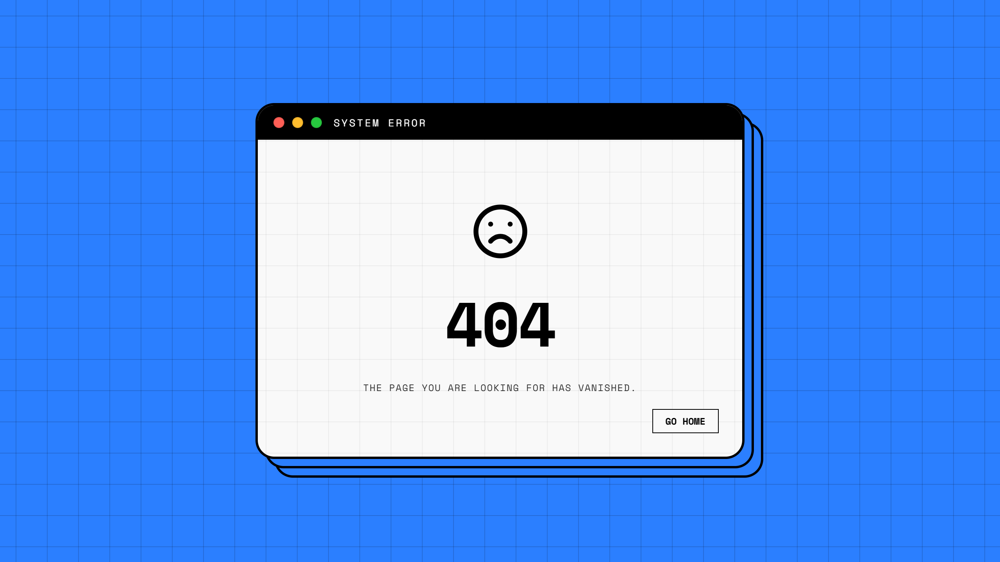
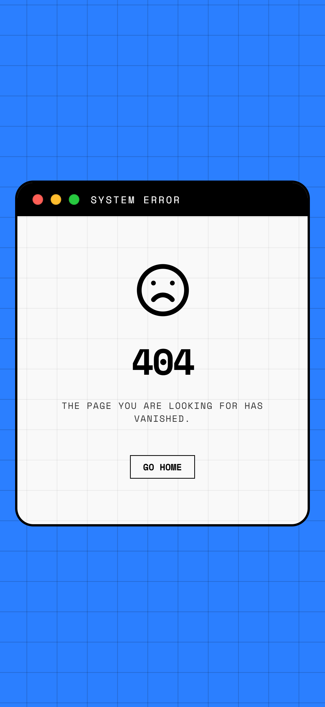

# 404-retro-macos-window

A sleek **retro 404 error page** inspired by classic macOS desktops. This project features a minimal monospace design with macOS-style title bar controls, interactive color switching, and a clean, responsive UI.

Built with pure **HTML, CSS & JavaScript** — lightweight, no dependencies, and perfect for modern websites seeking a polished retro touch.

## ✨ Features

- **Retro macOS Design** — Authentic title bar with colored control buttons
- **Interactive Color Switching** — Click the window controls to change background colors dynamically
- **Minimal & Clean** — Pure monospace typography with grid background pattern
- **Fully Responsive** — Works seamlessly on desktop, tablet, and mobile devices
- **Lightweight** — Zero dependencies, ~30KB total size
- **Accessibility-Focused** — Semantic HTML and keyboard-friendly controls
- **Open Source** — MIT License

## 🎨 Preview

| View | Preview | Video |
|------|---------|-------|
| **Desktop** |  | [Color Controls Demo](assets/previews/color-controls.mp4) |
| **Mobile** |  | [Instagram/YouTube Demo](assets/previews/social-media/youtube-short-and-instagram-reel.mp4) |

## 🚀 Quick Start

### Direct Integration (As 404 Error Page)
1. Copy `index.html`, `script.js`, and `style.css` from this repository  
2. **Rename** `index.html` to **`404.html`**
3. Place 404.html in your **web root directory** (usually `/public`, `/www`, or `/`)
4. Your web server will automatically serve `404.html` when a page is not found
5. Customize the content as needed

**Note:** The server must be configured to serve `404.html` on 404 errors. Most hosting platforms handle this automatically.

## 📂 File Structure

```
.
├── index.html           # Main page structure
├── style.css            # Retro macOS-inspired styling
├── script.js            # Interactive color switching
├── LICENSE              # MIT License
├── README.md            # This file
├── CONTRIBUTING.md      # Contribution guidelines
└── assets/
    └── previews/        # Preview images and videos
        ├── desktop.png
        ├── mobile.png
        ├── featured-and-gallery.png
        └── social-media/
```

## 💻 Technical Details

### Browser Support
- Chrome/Edge 90+
- Firefox 88+
- Safari 14+
- Mobile browsers (iOS Safari, Chrome Mobile)

### Performance
- First Contentful Paint: < 100ms
- Fully Interactive: < 500ms
- CSS Grid Background: Hardware-accelerated

## 🎯 How It Works

The 404 page uses:
- **macOS-style controls** — Red, Yellow, Green color dots as window controls
- **Dynamic color switching** — CSS custom properties and JavaScript event listeners
- **Grid background** — CSS linear gradients for the retro grid pattern
- **Responsive layout** — Flexbox and relative units for all screen sizes

## 🛠️ Customization

### Change the Default Color
Edit the `--bg-color` CSS variable in `style.js`:
```javascript
changeColor('#2b7fff'); // Default blue
```

### Modify Window Size
Adjust the `.window-wrapper` max-width in `style.css`:
```css
max-width: 620px; /* Change this value */
```

### Update Text Content
Edit the `404` message and description in `index.html`:
```html
<h1>404</h1>
<p>Page not found</p>
```

## 📄 License

MIT License © 2026 [Not Found Pages](https://notfoundpages.github.io)

See [LICENSE](LICENSE) file for details.

## 🤝 Contributing

We welcome contributions! See [CONTRIBUTING.md](CONTRIBUTING.md) for guidelines on how to help.

## 📞 Support

- **Issues** — [GitHub Issues](https://github.com/notfoundpages/404-retro-macos-window/issues)
- **Website** — [notfoundpages.github.io](https://notfoundpages.github.io)
- **Social Media** — [@notfoundpages](https://twitter.com/notfoundpages)

---

**Made with ❤️ by [Not Found Pages](https://notfoundpages.github.io)**
