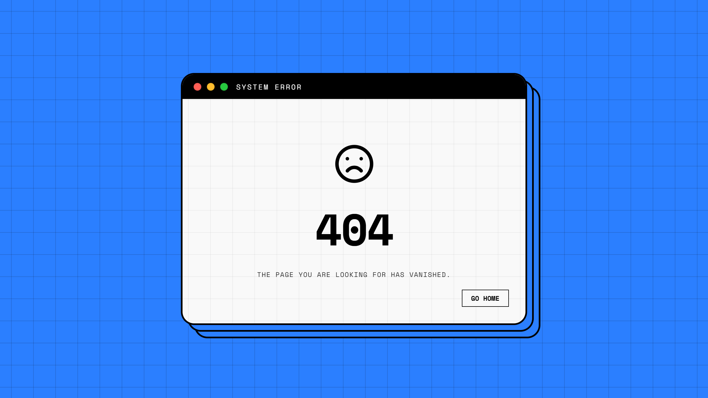
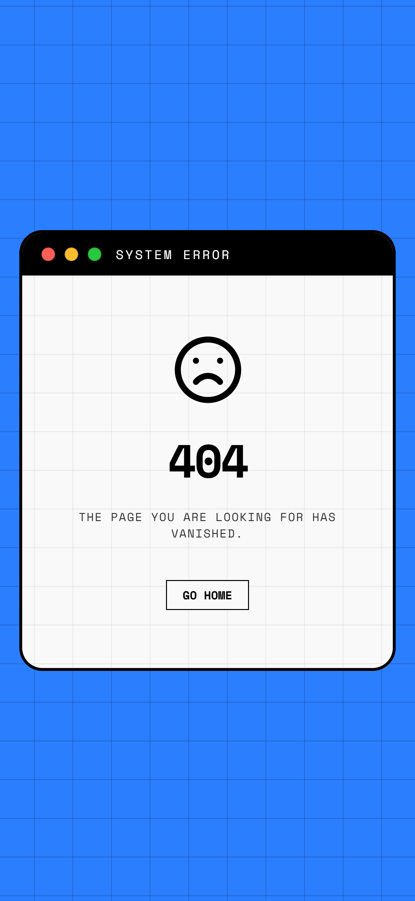

  

<h1 align="center"><a href="https://notfoundpages.github.io/404-retro-macos-window">404-retro-macos-window</a></h1>

  A sleek, macOS-inspired 404 error page with a nostalgic retro interface, interactive color controls, and a clean monospace aesthetic.

<h3 align="center">
  <a href="https://notfoundpages.github.io/404-retro-macos-window">Live Demo</a>
  ·
  <a href="https://github.com/notfoundpages/404-retro-macos-window">Source Code</a>
  ·
  <a href="https://github.com/notfoundpages/404-retro-macos-window/issues">Issues</a>
</h3>

## Overview

A 404 page doesn't have to feel like an error.

**404 Retro macOS Window** transforms the familiar "page not found" experience into a small, interactive desktop-inspired interface. It combines classic macOS-style window controls with a minimalist retro design, subtle grid background, and dynamic color switching.

Built entirely with **HTML, CSS, and vanilla JavaScript**, the page has no frameworks, no dependencies, and no build step.

Just copy it into your project, customize it, and make your 404 page feel like part of your website.

## Preview

| Desktop | Mobile |
|------|---------|
|  |  |

<table width="100%">
  <tr>
    <td width="50%" align="left" valign="middle">
      
    </td>
    <td width="50%" align="left" valign="middle">
      The classic macOS-style window controls aren't just decorative - they're fully interactive.
      Click the <b>red</b>, <b>yellow</b>, or <b>green</b> control to instantly switch
      the page's background color, adding a subtle touch of personality while preserving
      the clean, retro desktop aesthetic.
    </td>
  </tr>
</table>

## Quick Start

### GitHub Pages

Using it with **GitHub Pages** is simple:

1. Rename `index.html` to `404.html`.
2. Keep `404.html` in the **root** of your repository.
3. If using the external version, keep `style.css` and `script.js` alongside it.
4. Commit and push your changes.

GitHub Pages automatically serves a root-level `404.html` when a visitor reaches a page that doesn't exist.

### Other Hosting

For other hosting platforms, rename `index.html` to `404.html` and upload it to your website's public or root directory.

If you're using the external version, upload `style.css` and `script.js` alongside it.

Most hosting platforms automatically serve `404.html` for missing pages. If yours requires additional configuration, check your hosting provider's documentation for setting a custom 404 page.

### Inline Version

Prefer a single file? Use either `inline/index.html` or the minified `inline/index.min.html`.

Simply copy the contents into a new `404.html` in your repository or hosting root and you're ready to go – no external CSS, JavaScript, or assets required.

  <strong>Made with ❤️ by <a href="https://notfoundpages.github.io">Not Found Pages</a></strong>

  Give your visitors something better than a dead end.

